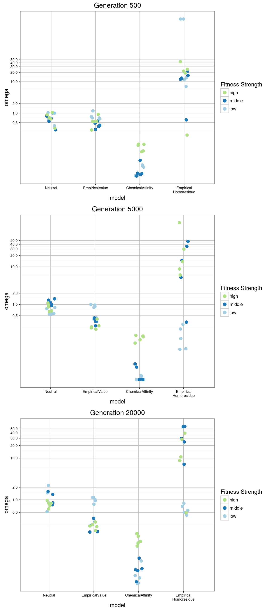

# SANTA-dNdS

Explore dN/dS ratios in viral populations simulated with SANTA.
The idea is to verify that selection functions in SANTA are working
through standard measures for purifying and
positive selection.

## Basic usage

To gather statistics and build plots that explore [SANTA](https://github.com/santa-dev/santa-sim) memory and runtime performance,
```
	$ scons -j 10
```
Warning: No attempt has been made to make this code portable to
environments outside the Hutch.

Running the simulations under various combinations of population size
and sequence length will take many hours to complete.  Two
optimizations are included in the `SConstruct` file to hopefully make this process faster.  The
`SConstruct` file uses the `srun` command from the
`[SLURM](http://slurm.schedmd.com/)` cluster management package to launch jobs on the Hutch center cluster resources.  Also,
because the heavy lifting is offloaded to the cluster, we use `-j N`
to launch multiple simulations in parallel.

Configuration files and output from the inividual simulations are left
directories under `build/`.  Aggregated statistics are left in
`build/results.csv`.  Those results can be plotted with
`plot_results.R`

# Results



# Methodology

1. Sample from simulated populations under a variety of conditions.
2. Measure dN/dS ratios to  determine if simulation conditions affect
sample populations in predictable ways.

We configure SANTA to evolve populations under four selection
conditions: 'noselection', 'purifyingchem', 'empiricalvalues',
'empiricalvalues_homoresidue'.  All of these conditions are unbiased in
the generation of substitution mutations, and all configurations
penalize in-frame STOP codons as lethal mutations.  Further details of
each configuration are explained in the next section.

Multiple replicated simulations
are configured and run for each of three fitness values: low, medium,
and high.  The actual fitness values
depend upon the particular selection condition being use, i.e. low
might be '0.001' for 'purifyingchem' and '.1' for  'empiricalvalues'.
The simulations are configured to emit samples of sequences at multiple
intervals to assess how the population changes over time.

The sequences sampled from each simulation are deduplicated before
being used as input to [BEAST](http://beast.bio.ed.ac.uk/) to infer a
phylogenetic tree.  The tree and deduplicated samples are then passed
to [PAML](http://abacus.gene.ucl.ac.uk/software/paml.html) for
calculation of a single dN/dS value for the entire tree.

# Details of Selection configurations

'noselection' has no fitness constraints other than
penalizing in-frame STOP codons.

'purifyingchem' uses an `<purifyingFitness>` element to apply a linear
decay fitness function at each residue position which favors residues
that are chemically similar to the starting residue.
```xml
	 <fitnessFunction>
	     <purifyingFitness>
	         <feature>C2C3</feature>
	         <sites>1-156</sites>
	         <rank>
	             <order>chemical</order>
	             <breakTies>random</breakTies>
	         </rank>
	         <fitness>
	             <lowFitness>$fitness</lowFitness>
	             <minimumFitness>0.1</minimumFitness>
	         </fitness>
	     </purifyingFitness>
	 </fitnessFunction>
```

In other words,
each residue will have a preference for the original residue at that
site, with a decaying preference for chemically similar residues.
Outside of chemically similar residues, fitness drops off to a constant,
minimal value.  This should serve to maintain the amino acids content
of a simulated genome, with some variation due to  synonymous
mutations and chemically similar
residues.

'empiricalvalues' uses an `<empiricalSelection>` element that assigns
specific values to each amino acid residue.  For this experiment all
residues except for Lysine get asssigned the same fitness value.  the
fitness value assigned to Lysine is a parameter of the simulation.

```xml
	 <fitnessFunction>
	   <empiricalFitness>
	     <feature>C2C3</feature>
	     <sites>1-156</sites>
	     <!-- assign fitness to each amino acid at this site -->
	     <!-- Order of Amino cacids is A-C-D-E-F-G-H-I-K-L-M-N-P-Q-R-S-T-V-W-Y -->
	     <values>
	 	  0.010 0.010 0.010 0.010 0.010
	 	  0.010 0.010 0.010 $fitness 0.010
	 	  0.010 0.010 0.010 0.010 0.010
	 	  0.010 0.010 0.010 0.010 0.010
	 	</values>
	   </empiricalFitness>
	 </fitnessFunction>
```

'empiricalvalues_homoresidue' uses the same fitness
function as'empiricalvalues', but the inital population starts with a
genomethat entrely consisting of codons that code for Lysine, e.g.
```xml
    <sequences>
	AAAAAAAAAAAAAAAAAAAAAAAA...AAAAAAAAAAAAAAAAAAAAAAA
    </sequences>

```

## current status (Sept 2016)

PLots are available (Where?)
plots can be generated (How?)

Epirical homoResidue plot looks strange, with a bunc of wildly
inflated dn/ds ratios


Whay is that?  Is paml crashing?
if so, why?

Trying to build `$ scons build/empiricalvalues_homoresidue/fit_0.0105/rep_0/`
This runs to completion but it looks like codeml is not actually
running!!
```
sed 's#seqfile.txt#sample_aln.phylip#g' < codeml.ctl > build/empiricalvalues_homoresidue/fit_0.0105/rep_0/gen_5000/codeml.ctl
scons: done building targets.
```
This may be because the `codeml` dependencies are not coirrectly
specified in the SConstruct file.  Take a look at those...

```
@w.add_target_with_env(env)
def results(env, outdir, c):
    return env.Command(os.path.join(outdir, 'results.txt'),
                       c['config'],
                       'srun --time=30 --chdir=${OUTDIR} codeml ${SOURCE.file}'
                       )[0]
```
Oh yeah, that's not right.  The codeml command only depends on the
config file, but that is hardly the complete set of dependencies for
codeml.  The codeml config file points to a tree file and a fasta file, so
those need to be in the dependency lists too.
I'm sure the rule for building config file itself depends on those
input files, but the same config file will be generated for any fasta
and tree file combination.  We must explicitly carry those
dependencies forward to anything that depends on this config file.

Sconstruct file fixed, bow running codeml
```
$ scons -n build/empiricalvalues_homoresidue/fit_0.0105/rep_0/
scons: Reading SConscript files ...
scons: done reading SConscript files.
scons: Building targets ...
srun --time=30 --chdir=build/empiricalvalues_homoresidue/fit_0.0105/rep_0/gen_20000 codeml codeml.ctl
srun --time=30 --chdir=build/empiricalvalues_homoresidue/fit_0.0105/rep_0/gen_500 codeml codeml.ctl
srun --time=30 --chdir=build/empiricalvalues_homoresidue/fit_0.0105/rep_0/gen_5000 codeml codeml.ctl
```

NB Completed.
```
real    79m40.007s
user    0m9.127s
sys     0m1.666s
```

While that is running go look at the set of sequences that `codeml` is
being run on.  Are the sequences all identical?  Are they very closely
related?

Take a look at `sample_dedup.fa` which is the precursor for
`sample_aln.phylip`.
```
$ seqmagick info sample_dedup.fa
name            alignment    min_len   max_len   avg_len  num_seqs
sample_dedup.fa TRUE             468       468    468.00        22
```

~~You need to adapt the genome diversity measure from santa-purifying to
us on the samples from santa-dnds.~~

No you don't - all we want to know if how many unique sequences we
have in each generation.  We already have that in `sample_dedup.fa`

```
$ seqmagick info $(find build/empiricalvalues_homoresidue/fit_0.0105 -name sample_dedup.fa )
 name                                                                         alignment    min_len   max_len   avg_len  num_seqs
build/empiricalvalues_homoresidue/fit_0.0105/rep_0/gen_5000/sample_dedup.fa  TRUE             468       468    468.00        24
build/empiricalvalues_homoresidue/fit_0.0105/rep_0/gen_20000/sample_dedup.fa TRUE             468       468    468.00        22
build/empiricalvalues_homoresidue/fit_0.0105/rep_0/gen_500/sample_dedup.fa   TRUE             468       468    468.00        22
build/empiricalvalues_homoresidue/fit_0.0105/rep_4/gen_5000/sample_dedup.fa  TRUE             468       468    468.00        27
build/empiricalvalues_homoresidue/fit_0.0105/rep_4/gen_500/sample_dedup.fa   TRUE             468       468    468.00        23
build/empiricalvalues_homoresidue/fit_0.0105/rep_4/gen_20000/sample_dedup.fa TRUE             468       468    468.00        23
build/empiricalvalues_homoresidue/fit_0.0105/rep_1/gen_5000/sample_dedup.fa  TRUE             468       468    468.00        22
build/empiricalvalues_homoresidue/fit_0.0105/rep_1/gen_20000/sample_dedup.fa TRUE             468       468    468.00        30
build/empiricalvalues_homoresidue/fit_0.0105/rep_1/gen_500/sample_dedup.fa   TRUE             468       468    468.00        23
build/empiricalvalues_homoresidue/fit_0.0105/rep_2/gen_5000/sample_dedup.fa  TRUE             468       468    468.00        20
build/empiricalvalues_homoresidue/fit_0.0105/rep_2/gen_500/sample_dedup.fa   TRUE             468       468    468.00        31
build/empiricalvalues_homoresidue/fit_0.0105/rep_2/gen_20000/sample_dedup.fa TRUE             468       468    468.00        26
build/empiricalvalues_homoresidue/fit_0.0105/rep_3/gen_5000/sample_dedup.fa  TRUE             468       468    468.00        22
build/empiricalvalues_homoresidue/fit_0.0105/rep_3/gen_20000/sample_dedup.fa TRUE             468       468    468.00        28
build/empiricalvalues_homoresidue/fit_0.0105/rep_3/gen_500/sample_dedup.fa   TRUE             468       468    468.00        23
```

Those all look fine.  It doesn't look like there are any samples with
unusually low sequence count.


